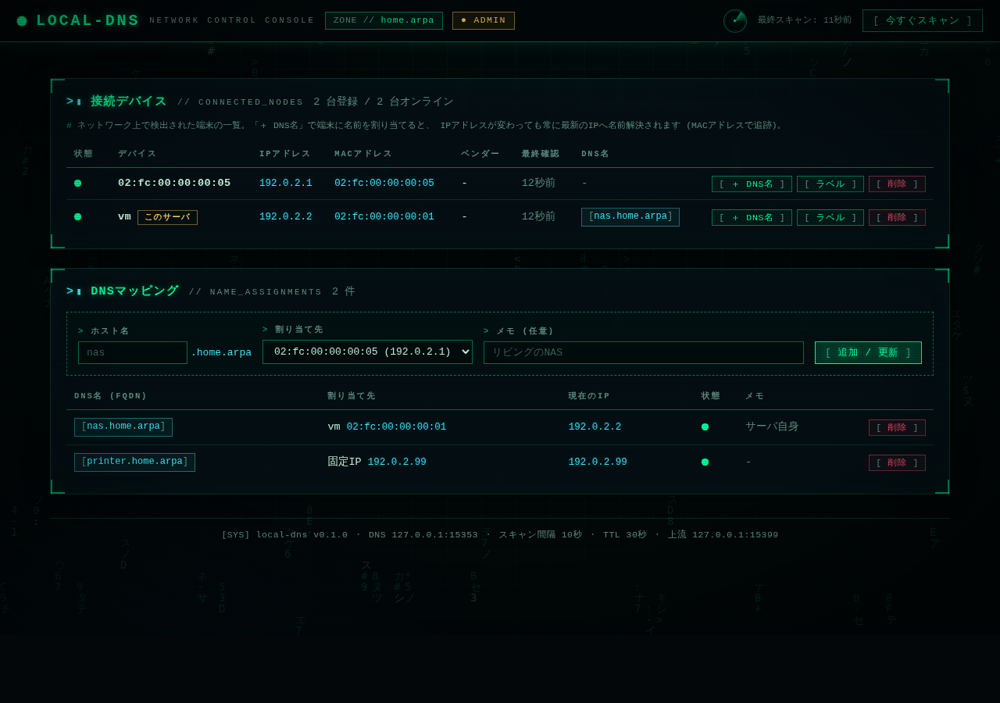
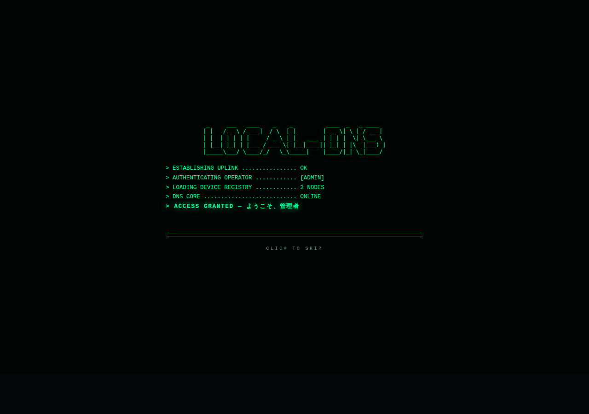

# local-dns

家庭内ネットワーク向けの「かんたん設定 DNS サービス」です。
LAN 上の端末を **MAC アドレスで自動追跡** し、DHCP で IP アドレスが変わっても
**常に最新の IP に解決される DNS 名** を割り当てられます。設定は Web 管理画面から行えます。

```
nas.home.arpa      → 192.168.1.42   (NAS の「今の」IP に自動追従)
printer.home.arpa  → 192.168.1.200  (固定IPの登録も可能)
living-tv.home.arpa → ...           (何台でも登録可能)
```



管理画面は「ネットワーク管制コンソール」風のターミナル UI です。
アクセス時にはブートシーケンス演出が流れます (クリックでスキップ可能)。



## 特徴

- **依存ゼロ・シングルバイナリ** — Go 標準ライブラリのみで実装。`local-dns` 1ファイルを置くだけで動作
- **DHCP 環境でも正確** — ルーターが DHCP サーバのままで OK。ARP テーブル + アクティブスキャンで
  約30秒ごと(設定可)に端末の IP を追跡し、DNS 応答へ即時反映(TTL 30秒)
- **MAC アドレスがキー** — IP が変わっても同じ端末として認識し、名前が追従
- **フル機能の DNS サーバ** — 管理外の名前は上流 (Cloudflare/Google/ルーター等) へ転送するので、
  LAN の「メイン DNS」としてルーターから配布できます (EDNS/DNSSEC はそのまま素通し)
- **Web 管理画面** — 接続端末の一覧 (IP / MAC / ホスト名 / ベンダー / オンライン状態) と、
  DNS 名の割り当て・管理。ハッカー映画風のダークコンソール UI (マトリックス背景、
  グリッチ演出、ブートシーケンス付き。`prefers-reduced-motion` 環境では自動的に簡略化)
- **端末名の自動検出** — mDNS (Apple/Linux/Android) と NetBIOS (Windows) で端末のホスト名を自動取得
- **CUI サーバ向け** — Ubuntu 上で systemd サービスとして常駐 (`DynamicUser` + 最小権限)

## 仕組み

```
                       ┌───────────────────────────── local-dns ─┐
  LAN の端末           │                                          │
  ┌──────────┐  ARP    │  ┌──────────┐   MAC→IP   ┌────────────┐  │
  │ スマホ    │◄───────┼──┤ スキャナ  ├───────────►│ デバイス台帳 │  │
  │ NAS      │  スイープ│  │(30秒毎)  │            │ + マッピング │  │
  │ PC ...   │         │  └──────────┘            │ (state.json)│  │
  └──────────┘         │                          └──────┬─────┘  │
                       │                                 │        │
  名前解決 ┌───────┐    │  ┌──────────────────────────────▼─────┐  │
  ────────►│ :53   ├────┼──┤ DNS サーバ                          │  │
           └───────┘    │  │  *.home.arpa → 台帳から現在のIPを応答│  │
                        │  │  それ以外    → 上流DNSへ転送         │  │
  管理画面 ┌───────┐    │  └────────────────────────────────────┘  │
  ────────►│ :8080 ├────┼──► Web UI / JSON API                     │
           └───────┘    └──────────────────────────────────────────┘
```

1. **スキャナ** が定期的にサブネット全体へ無害な UDP パケットを送り (ARP 解決の誘発)、
   カーネルの ARP テーブル (`/proc/net/arp`) から「MAC ⇔ 今の IP」を取得します。
   root 権限や raw ソケットは不要です。
2. **デバイス台帳** に MAC アドレスをキーとして端末を記録し、mDNS / NetBIOS で
   ホスト名、OUI 辞書でベンダー名を補完します。
3. **DNS サーバ** は `ホスト名 → MAC` のマッピングを、応答時点の最新 IP に解決します。
   IP の変化は「スキャン間隔 + TTL」(既定 約30〜60秒) 以内に反映されます。

## 必要要件

- Ubuntu 20.04 以降を想定 (他の Linux でも動作します)。CUI のみで OK
- ビルドに Go 1.22 以降 (Ubuntu 24.04 なら `sudo apt install golang-go`)
  - 外部モジュール依存が無いため、ビルドにインターネット接続は不要です
- サーバ機は LAN に有線/無線で接続され、**固定 IP** (または DHCP 予約) を推奨

## インストール

```bash
git clone https://github.com/okmtdev/local-dns.git
cd local-dns
make build          # ./local-dns ができる
sudo make install   # /usr/local/bin へ配置 + systemd ユニット + 設定ファイル
```

### 1. ポート 53 を空ける (Ubuntu 必須手順)

Ubuntu では `systemd-resolved` がポート 53 (127.0.0.53) を使用しているため、
スタブリスナーを無効化します:

```bash
sudo mkdir -p /etc/systemd/resolved.conf.d
sudo tee /etc/systemd/resolved.conf.d/local-dns.conf <<'EOF'
[Resolve]
DNSStubListener=no
DNS=127.0.0.1
EOF
sudo ln -sf /run/systemd/resolve/resolv.conf /etc/resolv.conf
sudo systemctl restart systemd-resolved
```

`DNS=127.0.0.1` により、このサーバ自身の名前解決も local-dns 経由になります
(local-dns 停止中でも困らないようにしたい場合は `DNS=127.0.0.1 1.1.1.1` などに)。

### 2. 起動

```bash
sudo systemctl daemon-reload
sudo systemctl enable --now local-dns
systemctl status local-dns
```

動作確認:

```bash
dig @127.0.0.1 example.com +short      # 上流への転送が動くか
curl -s http://127.0.0.1:8080/api/status | jq   # API が動くか
```

### 3. LAN の端末にこの DNS を使わせる

ルーターの **DHCP 設定で「DNS サーバ」をこのマシンの IP に変更** します
(例: 192.168.1.2)。以降、DHCP 更新のタイミングで LAN 内の全端末が
local-dns を使い始めます。

> ルーターに DNS 配布設定が無い場合は、各端末のネットワーク設定で DNS を
> 手動指定しても使えます。

上流 DNS をルーター (例: `upstreams: 192.168.1.1`) にすると、ルーターが
配布していた既存の名前もそのまま引き続き解決できます。

## 使い方

1. ブラウザで `http://<サーバのIP>:8080/` を開く
2. 「接続デバイス」に LAN 上の端末が自動で並びます (初回スキャンは起動直後)
3. 名前を付けたい端末の **「＋ DNS名」** を押してホスト名 (例: `nas`) を入力
4. どの端末からでも `nas.home.arpa` でアクセスできるようになります

```bash
dig @192.168.1.2 nas.home.arpa +short
# → 192.168.1.42   (端末のIPが変わっても自動で追従)
```

- 端末には「ラベル」(例: お父さんのノートPC) を付けて一覧を見やすくできます
- 1台の端末に複数の DNS 名を割り当て可能。登録台数に制限はありません
- サーバや NAS など固定 IP の機器には「固定IPを直接指定…」でも登録できます
- 「今すぐスキャン」で手動スキャンも可能です

### curl での操作 (CUI から使う場合)

Web UI と同じ操作は JSON API でも行えます:

```bash
# デバイス一覧
curl -s http://127.0.0.1:8080/api/devices | jq

# DNS名の割り当て (MAC 追跡)
curl -s -X POST http://127.0.0.1:8080/api/mappings \
  -H 'Content-Type: application/json' \
  -d '{"hostname":"nas","mac":"aa:bb:cc:dd:ee:ff","note":"リビングのNAS"}'

# 固定IPの登録
curl -s -X POST http://127.0.0.1:8080/api/mappings \
  -H 'Content-Type: application/json' \
  -d '{"hostname":"printer","ip":"192.168.1.200"}'

# 削除
curl -s -X DELETE http://127.0.0.1:8080/api/mappings/nas
```

## 設定リファレンス

設定ファイル: `/etc/local-dns/config.conf` (書式は 1 行 1 設定の `キー: 値`。
[config.example.conf](config.example.conf) にコメント付きの全設定例があります)。
変更後は `sudo systemctl restart local-dns` で反映されます。

| キー | 既定値 | 説明 |
| --- | --- | --- |
| `domain` | `home.arpa` | 管理ドメイン。RFC 8375 の家庭用予約ドメイン。`lan` 等に変更可 |
| `dns_listen` | `:53` | DNS 待ち受けアドレス (UDP/TCP) |
| `web_listen` | `:8080` | Web UI / API 待ち受けアドレス |
| `upstreams` | `1.1.1.1, 8.8.8.8` | 上流 DNS (カンマ区切り、順にフォールバック)。ルーター指定推奨 |
| `ttl` | `30` | 管理レコードの TTL 秒 |
| `answer_single_label` | `true` | `nas` のような単一ラベル問い合わせにも応答 |
| `scan_interval` | `30s` | スキャン間隔。IP 変更の追従ラグの上限 (要件: 1分以内) |
| `scan_cidr` | (自動) | スキャン対象サブネットの上書き。例 `192.168.1.0/24` |
| `scan_interface` | (自動) | 使用インタフェースの固定。例 `eth0` |
| `disable_sweep` | `false` | アクティブスイープ無効化 (受動 ARP のみ) |
| `state_path` | `/var/lib/local-dns/state.json` | 台帳の保存先 (JSON 1 ファイル) |
| `oui_paths` | (自動検出) | MAC ベンダー辞書の追加パス |
| `web_username` / `web_password` | (なし) | 両方設定すると Web UI に Basic 認証 |
| `log_level` | `info` | `debug` / `info` / `warn` / `error` |

ベンダー名の表示には OUI 辞書が必要です: `sudo apt install ieee-data`
(nmap や wireshark の辞書も自動検出します)。

## HTTP API リファレンス

| メソッド / パス | 説明 |
| --- | --- |
| `GET /api/status` | バージョン・ドメイン・最終スキャン時刻・台数など |
| `GET /api/devices` | 検出済みデバイス一覧 (MAC, IP, ホスト名, ベンダー, オンライン, 割当名) |
| `PATCH /api/devices/{mac}` | `{"label": "..."}` でラベル設定 (空文字で削除) |
| `DELETE /api/devices/{mac}` | デバイスを台帳から削除 (再検出されれば復活) |
| `GET /api/mappings` | DNS マッピング一覧 (現在の解決先 IP 付き) |
| `POST /api/mappings` | `{"hostname","mac"または"ip","note"}` で作成/更新 |
| `DELETE /api/mappings/{hostname}` | マッピング削除 |
| `POST /api/scan` | 即時スキャンを要求 |
| `GET /healthz` | ヘルスチェック |

## 動作の詳細と注意点

- **追従ラグ**: IP 変更が DNS に反映されるまで最大「`scan_interval` + `ttl`」
  (既定 約60秒)。要件の「1分程度のラグ許容」に収まるよう既定値を設定しています
- **オンライン判定**: 「最後に ARP で確認できてから `3 × scan_interval`(最低90秒)以内」
  をオンラインとしています。スリープ中のスマホなどは一時的にオフライン表示に
  なることがありますが、登録した DNS 名は最後に確認できた IP を応答し続けます
- **MAC ランダム化**: iOS / Android の「プライベート Wi-Fi アドレス」は
  ネットワーク (SSID) ごとに固定の MAC を使うため通常は問題ありません。
  ただし「ランダム化を毎回変える」設定の端末は同一端末として追跡できません。
  その端末側で自宅 Wi-Fi のみランダム化をオフにするか、固定 MAC にしてください
- **IPv4 が対象**: 端末追跡は IPv4 (ARP) ベースです。管理名への AAAA 問い合わせには
  「名前は存在するがレコード無し (NODATA)」を返し、管理外の AAAA は上流へ転送します
  (固定 IP マッピングには IPv6 アドレスも登録可能)
- **逆引き**: 割り当て済み IP への PTR 問い合わせには `ホスト名.ドメイン` を返します
- **複数サーバでの運用**: local-dns 自体を 2 台で動かして冗長化する場合は、
  それぞれをインストールして同じマッピングを登録してください
  (台帳は `state.json` のコピーで移行できます)
- **セキュリティ**: 家庭内 LAN での利用を想定しています。DNS/Web ポートを
  インターネットへ公開しないでください。Web UI には Basic 認証を設定できます

## トラブルシューティング

| 症状 | 対処 |
| --- | --- |
| `listen udp :53: bind: address already in use` | 上記「ポート 53 を空ける」を実施。`sudo ss -lunp 'sport = :53'` で使用者を確認 |
| デバイスがほとんど出てこない | サブネット自動検出の失敗が考えられます。`scan_interface: eth0` や `scan_cidr: 192.168.1.0/24` を明示。`journalctl -u local-dns` にヒントが出ます |
| ベンダー名が「-」のまま | `sudo apt install ieee-data` 後に再起動 |
| 名前は引けるが端末がオフライン表示 | ファイアウォールで UDP を落とす端末でも ARP には応答するため通常は検出できます。Wi-Fi のスリープ中は検出されないことがあります (復帰後に再検出) |
| `home.arpa` を変えたい | `domain: lan` などに変更して再起動。`.local` は mDNS 予約のため避けてください |
| Windows で `nas` だけで引けない | 検索ドメインが必要です。`nas.home.arpa` のフル名を使うか、ルーターの DHCP で検索ドメイン (オプション 119) に `home.arpa` を配布してください |

## 開発

```bash
make test    # 全テスト (ユニット + DNS サーバの実ソケット統合テスト)
make vet     # go vet + gofmt チェック
make build   # ビルド (CGO 無効・静的バイナリ)
```

```
cmd/local-dns/       エントリポイント
internal/config/     設定ファイルの読み込み
internal/names/      ホスト名 / MAC の検証・正規化
internal/store/      デバイス台帳 + マッピング (JSON 永続化)
internal/scanner/    ARP 読み取り / スイープ / mDNS / NetBIOS / OUI
internal/dnsmsg/     DNS ワイヤフォーマット (RFC 1035) の実装
internal/dnsserver/  DNS サーバ (ローカルゾーン応答 + 上流リレー)
internal/web/        Web UI (埋め込み静的ファイル) + JSON API
packaging/           systemd ユニット
```

Raspberry Pi など別アーキテクチャ向けのクロスビルド:

```bash
GOOS=linux GOARCH=arm64 make build
```

## ライセンス

[MIT License](LICENSE)
